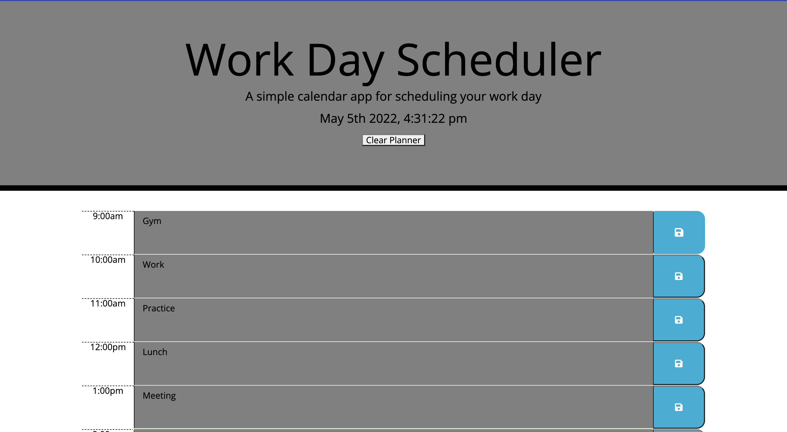

# Work-Scheduler-

## Description  

- The Work Day Scheduler application allows to the user to save events for each hour of the day. This app will run in the browser and feature dynamically updated HTML and CSS powered by jQuery.

## Table of Contents 

* [Installation](#installation)
* [Usage](#usage)
* [Credits](#credits)
* [License](#license)

## Installation

- Node.js is needed to run application
- Install npm using command lines (npm install)
- Install express (npm install express )
- Install jQuery (npm i jQuery)

## Usage 

## License

- No licenses were used

## Contribution
- Reggie Tenkorang

## Tests

- No test were performed. 

## Links

- Github Deployed Link: [https://reggietenk.github.io/Work-Scheduler-/]

- My Github [https://github.com/reggietenk]
